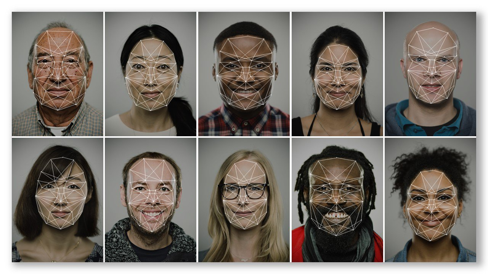
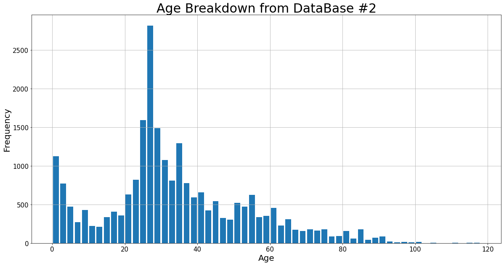
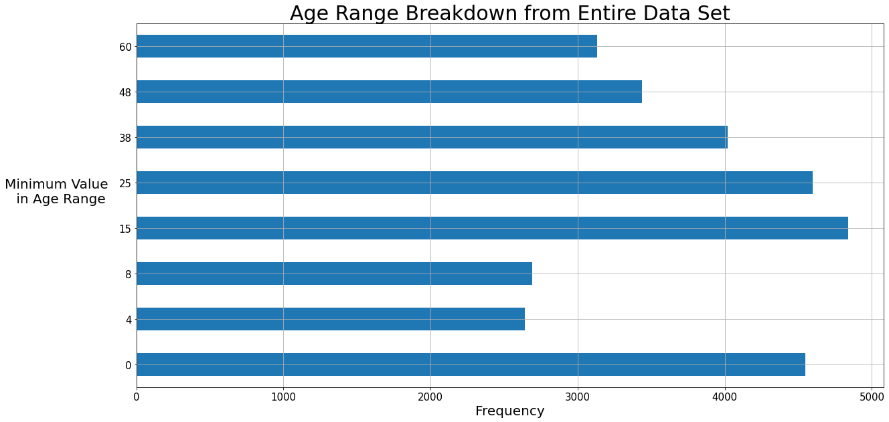
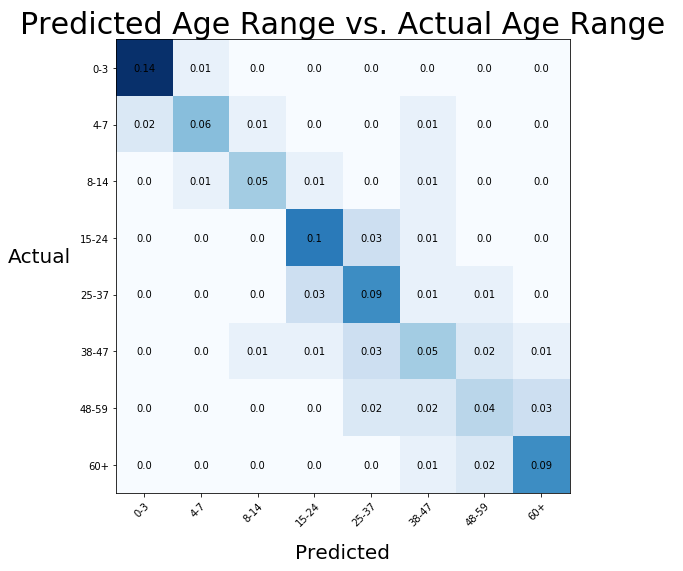
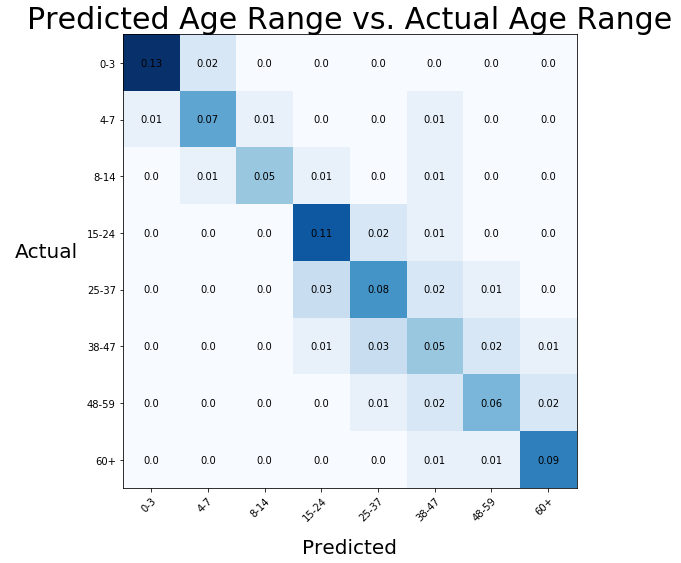
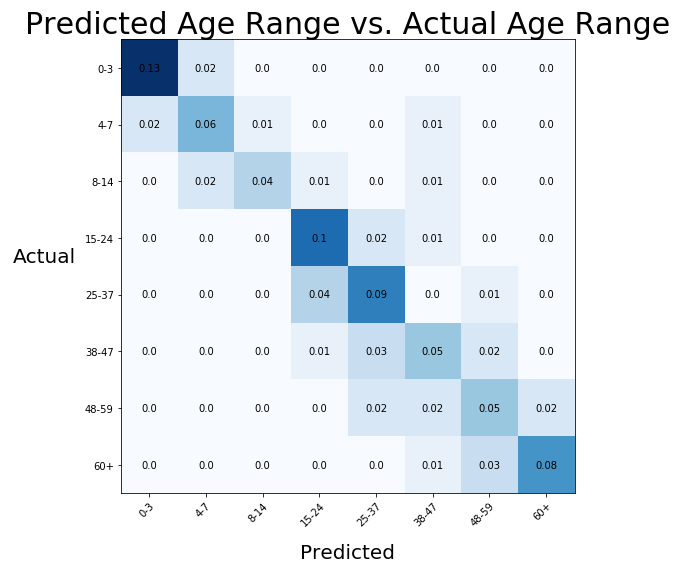
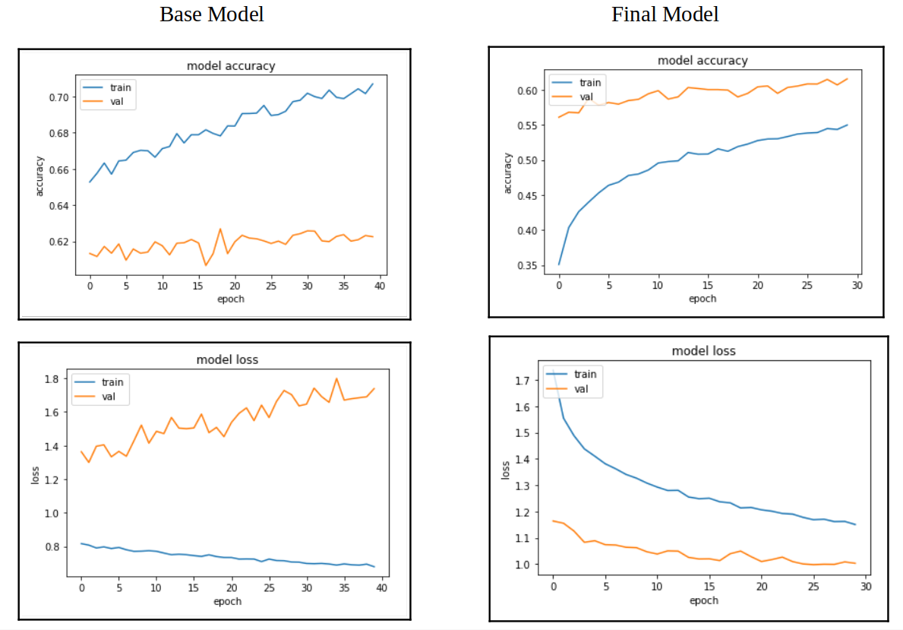

# Age Recognition using a Convolutional Neural Network

## Table of Contents

* [General Information](#General-Information)
    * [Exploratory Data Analysis](#Exploratory-Data-Analysis)
    * [CNN](#CNN)
    * [Final Results](#Final-Results)
    * [Tools Used](#Tools-Used)
    * [Future Improvements](#Future-Improvements)

## General Information
Convolutional Neural Networks (CNN) are a class of deep neural networks, most commonly applied to analyzing visual imagery. This projects aims combine three separate data sets in order to train a CNN to predict someones age based on an image of a human face. In the business environment age recognition may be able to assist companies in identifying customers legally allowed to buy firearms or assist identification models in correctly matching inbound travelers through airport security.

Project Inspiration: 'https://towardsdatascience.com/age-detection-using-facial-images-traditional-machine-learning-vs-deep-learning-2437b2feeab2'

_______________________________________________
## Exploratory Data Analysis: INCLUDE EXAMPLE DATASET

Over 50,000 labeled photos of human faces were compiled from three separate data sets ranging in age from newborn to 115 years old. Due to the uneven amount of photos by age the decision was made to group the data into 8 different age groups (0-3, 4-7, 8-14, 15-24, 25-37, 38-47, 48-59, 60-). Additionally, photos from one of the age groups had to be reduced in order to even out the overall distribution between groups.

### The project files are organized as follows:

- AgeRecognition.ipynb: Project executable code used in AWS SageMaker
- Images: Includes all images used in the README.md file and presentation
- Models: Includes all models created during the project
- Data: Includes Pickle File of compiled images in a Pandas DataFrame & a an example set

### Data used for CNN model were taken from the following locations:

>20,000 face images with annotations of age, gender, and ethnicity (https://susanqq.github.io/UTKFace/)

>10,000 images of faces saved in different age group folders (https://www.kaggle.com/frabbisw/facial-age)

> 26,000 images in age group: (0-2, 4-6, 8-13, 15-20, 25-32, 38-43, 48-53, 60-) (https://talhassner.github.io/home/projects/Adience/Adience-data.html)

____________________________________________________________

## CNN:

***Step 1: Establish Training and Testing Data***

The training and testing data was compiled from the three separate data sets with ages ranging from newborn to over 100 years old. The plot below shows the distribution of ages from the second data set.

  

Due to the uneven distribution of data the decision was make to split the final dataset into 8 different age groups (0-3, 4-7, 8-14, 15-24, 25-37, 38-47, 48-59, 60-) in order to more evenly distribute the data, as seen below.

  

***Step 2: Base Model Results***

The initial model used a combination of Convolutional, Max Pooling, Dense, and Dropout Layers with a test accuracy of ***61%***. Seen in the confusion matrix below, the most difficult ages to predict corresponded to the age ranges with the least amount of images: 4-7, 8-14, 38-47, and 48-59

  

***Step 3: Improving CNN Model***

Using a tuner function the model was incrementally improved by testing variations in the following areas. The resulting prediction accuracy increased to ***63.4%***.
- 1st Convolutional Layer: Filters - [***32***,64,128,256] = 0.532 or 4% incr.
- 2nd Convolutional Layer: Filters -      [32,64,***128***,256] = 0.552 or 8% incr.
- Dense Layer: Dimensionality Output -    [64,128,512,1024,***2048***] = 0.6006 or 18% incr.
- Dropout: Dropout Rate -                 [***0.2***, 0.4, 0.5, 0.6, 0.8] = 0.5790 or 14% incr.

  

***Step 4: Image Augmentation***

Using image augmentation the existing combined data set was increased by rotating, shifting, flipping, and shearing images within the original data set.

After running the tuned model over the augmented data set the resulting prediction accuracy increased to 65%. The corresponding confusion matrix is plotted below.

  

________________________________
## Final Results

The final CNN model is a result of hyperparameter tuning of the base model and data set expansion utilizing image augmentation. The final model increased the test accuracy from ***51%*** to ***65%***. Confusion marticies from the base and final model are shown below for comparison.

A final test was conducted by importing three different images of the developers face (35 years old) to see how well the model was able to predict their age.

  

_______________________________________
## Tools Used

***Database:***

Data Storage: AWS S3 

***Python:***

Data Gathering: Pandas 
Data Analysis: AWS Sage Maker, Tensor Flow, Keras, Pandas, Scikit-Learn 

***Visualization:***

Data Visualization: Matplotlib

_______________________________________
## Future Improvements

1. Encorporate video capture in order to predict age in real time utilizing webcam feed.
2. Explore the individual age data sets and compare the prediction accuracy to the current model.
